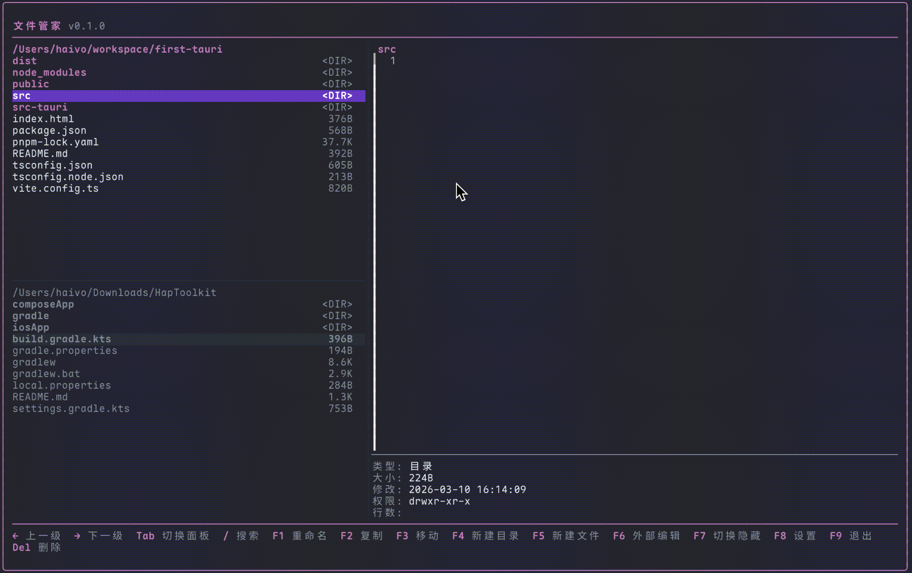

# FileMan

<p align="center">
  <strong>精美小巧的现代化终端文件管理器</strong>
</p>

<p align="center">
  基于 Go + Bubble Tea 构建
</p>

<p align="center">
  
</p>


---

## ✨ 功能特性

- **双面板界面** — 上下双面板设计，Tab 键快速切换焦点
- **实时预览** — 文本文件内容预览，自动识别文件类型
- **文件操作** — 利用双面板可将当前文件快速复制/移动到另一面板上、还支持删除、重命名、新建文件/目录
- **快速搜索** — 实时过滤当前目录文件
- **内置编辑** — 文本文件内置编辑器
- **鼠标支持** — 点击选择、滚动浏览
- **自适应布局** — 自动适配终端窗口大小

## 📦 安装

### 一键安装（推荐）

```bash
curl -fsSL https://raw.githubusercontent.com/Joehaivo/fileman/main/install.sh | bash
```


## 🚀 使用

```bash
fm
```

查看版本：

```bash
fm --version
```

## ⌨️ 快捷键

### 导航

| 按键 | 功能 |
|------|------|
| `↑` / `↓` | 光标上下移动 |
| `PgUp` / `PgDn` | 翻页 |
| `Home` / `End` | 跳转顶部/底部 |
| `←` | 返回上一级目录 |
| `→` / `Enter` | 进入目录或编辑文件 |
| `Tab` | 切换上下面板 |

### 文件操作

| 按键 | 功能 |
|------|------|
| `F1` | 重命名 |
| `F2` | 复制到另一面板 |
| `F3` | 移动到另一面板 |
| `F4` | 新建目录 |
| `F5` | 新建文件 |
| `F6` | 外部编辑器打开 |
| `F7` | 显示/隐藏文件 |
| `F8` | 设置 |
| `F9` | 退出 |
| `Del` | 删除 |
| `/` | 搜索 |
| `Esc` | 取消搜索/弹窗 |

### 编辑模式

| 按键 | 功能 |
|------|------|
| `↑` `↓` `←` `→` | 移动光标 |
| `F1` | 保存 |
| `F2` | 退出编辑 |
| `Home` / `End` | 行首/行尾 |
| `PgUp` / `PgDn` | 翻页 |

### 源码编译

```bash
git clone https://github.com/Joehaivo/fileman.git
cd fileman
go build -ldflags "-s -w -X main.version=$(git describe --tags --always)" -o fm .
```

## 🛠️ 技术栈

- [Bubble Tea v2](https://github.com/charmbracelet/bubbletea) — TUI 框架
- [Lip Gloss](https://github.com/charmbracelet/lipgloss) — 样式引擎
- [Bubbles](https://github.com/charmbracelet/bubbles) — UI 组件库

## 📄 许可证

[MIT](LICENSE)